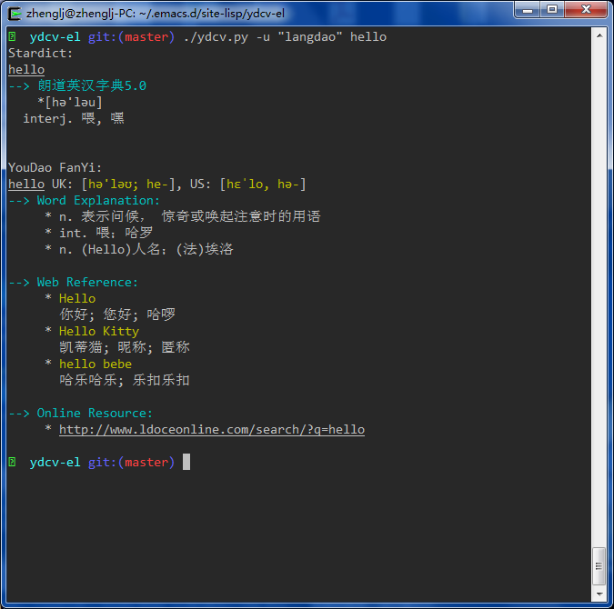
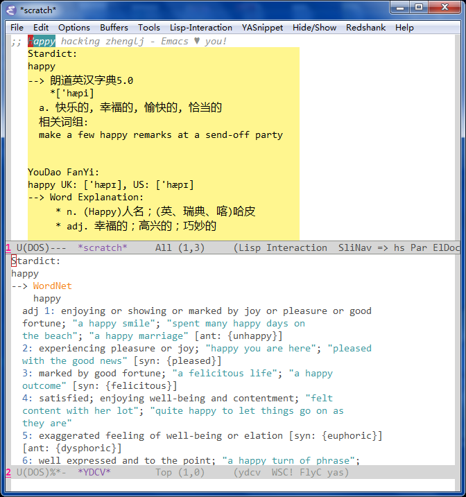

# YouDao Console Version

 * As an alternative to the StarDict Console Version(sdcv).
 * Also simple wrapper for Youdao online translate (Chinese <-> English) service [API](http://fanyi.youdao.com/openapi?path=data-mode).
 * Also as an plugin for Emacs.

## Environment

 * Python ( >=2.7, 3.x )

## Configuration for ydcv.el

```el
(require 'ydcv)
(setq ydcv-py-directory "~/.emacs.d/site-lisp/ydcv-el/")
(setq ydcv-dictionary-simple-list '("langdao"))
(setq ydcv-dictionary-complete-list
      '("langdao"
        ;; "21shiji"
        "dictd_www.dict.org_wn"))
(global-set-key (kbd "C-c ; b") 'ydcv-search-input)
(global-set-key (kbd "C-c ; t") 'ydcv-search-pointer+)
```

## Snapshoots



